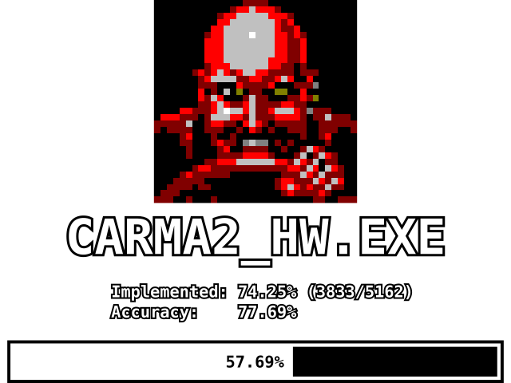

# Carpocalypse 2

Decompilation of 1998's Carmageddon 2.

## Status

## Requirements

- Carmageddon 2: this project needs the original game data function
- MSVC 5 SP3

## Build requirements

- 32-bit x86 compiler:
  - MSVC 11.0 (Visual Studio 97 SP3) compiler for matching build, or
  - a modern MinGW or MSVC toolchain
- DirectX SDK: we need `dinput` and `dxguid`.
  - MinGW provides these libraries out-of-the box
  - MSVC does not ship with a *DirectX SDK*: this [time-period correct version on archive.org](https://archive.org/details/MicrosoftDirectX7SDK) works perfect.
- [libtiff](http://www.libtiff.org/): this library is used to convert tiff images to BRender pixelmaps

## Goals

- Exact same behavior as the original
- Matching binary
- Every single commit should compile and work: this enables `git-bisect` to search for regressions

## Legal

Carpocalypse2 is a fan-made reverse-engineering research project,
licensed under the [GNU GPL v3](LICENSE). It contains no original game
code or assets — a legally obtained copy of *Carmageddon II:
Carpocalypse Now* is required to use it.

This project is not associated with, or endorsed by, SCi, Stainless
Software or THQ Nordic. All trademarks and copyrights related to
Carmageddon are the property of their respective owners.
