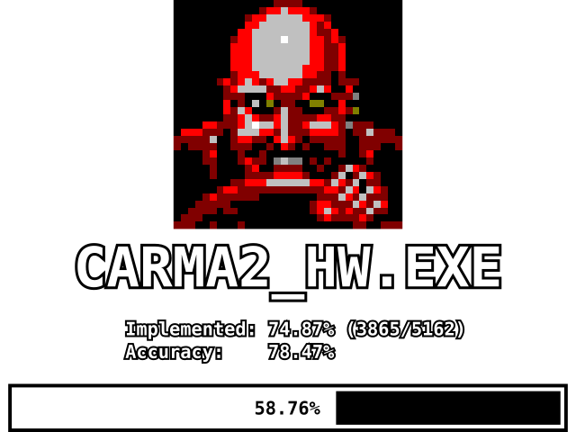

# Carpocalypse 2

<p align="center">
  
</p>

Decompilation of 1998's Carmageddon 2.

## Status

Screenshot progress




## Running

Both platforms below need the original game data; this repository ships none
(see Legal).

### Linux (AppImage)

Copy the data from a legally obtained Carmageddon II install in:

   ```
   ~/.local/share/carpocalypse2/DATA/     game data (required)
   ~/.local/share/carpocalypse2/MUSIC/    CD audio as Track02.ogg ... Track08.ogg (optional)
   ```

### Android (APK)

Push the original game data onto the device:

   ```
   adb push /path/to/C2/DATA \
     /sdcard/Android/data/com.carpocalypse2.game/files/DATA
   ```

   The app requests no storage permission and can only read its own
   app-specific directory, which is the path above. The data must be pushed
   after the app has been launched at least once (that creates the
   directory). Note that some Android 11+ devices refuse `adb` access to
   `Android/data` entirely; an in-app importer for those devices is planned,
   and is the only blocker for a permissionless data setup.
Start the app. Touch input is passed to the game as the pointer, so menus
   and the original controls are usable without a mouse; the app runs in
   sensor-landscape.

Debug-signed builds can only be replaced with `adb install -r` while the
signature still matches — reinstalling over a future release-signed build
requires uninstalling first.

## Build requirements

- SDL3
- 32-bit x86 compiler:
  - MSVC 11.0 (Visual Studio 97 SP3) compiler for matching build, or
  - a modern MinGW or MSVC toolchain
- DirectX SDK: we need `dinput` and `dxguid`.
  - MinGW provides these libraries out-of-the box
  - MSVC does not ship with a *DirectX SDK*: this [time-period correct version on archive.org](https://archive.org/details/MicrosoftDirectX7SDK) works perfect.
- [libtiff](http://www.libtiff.org/): this library is used to convert tiff images to BRender pixelmaps

### Linux

`sudo pacman -S cmake glslang sdl3`
```sh
mkdir build && cd build
cmake .. -DCMAKE_BUILD_TYPE=Release
make
```

## Goals

- Exact same behavior as the original
- Matching binary

## Legal

Carpocalypse2 is a fan-made reverse-engineering research project,
licensed under the [GNU GPL v3](LICENSE). It contains no original game
code or assets — a legally obtained copy of *Carmageddon II:
Carpocalypse Now* is required to use it.

This project is not associated with, or endorsed by, SCi, Stainless
Software or THQ Nordic. All trademarks and copyrights related to
Carmageddon are the property of their respective owners.
